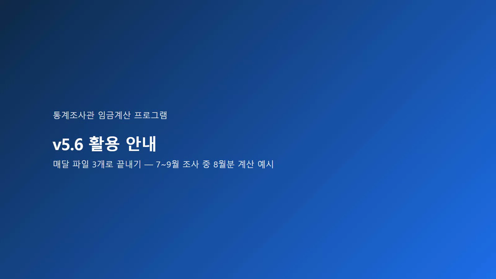

# 통계조사관 임금계산 (기간제 근로자 월 임금 자동산정 프로그램)

> 고용노동부 지방관서에서 **매월 반복되는 기간제 통계조사관 임금 산정**을 엑셀 수작업에서 **파일 2개 첨부 → 클릭 5번**으로 바꾼 독립 실행형(exe) 프로그램입니다.

| 항목 | 내용 |
|---|---|
| 현재 버전 | v5.6 |
| 형태 | Windows 단일 exe (설치·인터넷·서버 불필요, 100% 로컬 실행) |
| 예비 사용자 | 고용노동부 18개 지청 임금담당자 18명 |
| 배포 방법 | 내부저장소 공유문서함을 통한 exe 파일 배포 |
| 기술 스택 | Python 3 · FastAPI · pywebview(WebView2) · openpyxl · PyInstaller(onefile) |
| 코드 규모 | 파이썬 약 6,600 LOC / 자동화 테스트 234개(57개 파일) 전부 통과 / 커밋 138건 |

---

## 1. 활용 안내 영상 (4분)

[](docs/assets/demo.mp4)

▶ **[docs/assets/demo.mp4](docs/assets/demo.mp4)** — v5.6 기준, 7~9월 조사 중 8월분 계산 예시로 매달 파일 3개로 계산하는 전체 흐름 (3분 55초, 자막 포함)

영상 목차: `처음 한 번만: 설정 입력` → `1. 파일 첨부` → `2. 근무상황 확인` → `3. 대상자 확인(v5.6 담당조사·계약기간 자동 불러오기)` → `4. 계산 실행` → `5. 결과 확인` → `6. 엑셀 다운로드·보관`

---

## 2. 왜 만들었나 — 기존 방식(AS-IS)의 문제

기존에는 **5개 시트로 구성된 수식 기반 엑셀 계산기** 한 파일로 매월 임금을 산정했습니다.
(`0.2026관리대장` / `1.지급대상&공통입력값` / `2.근무상황추출` / `근무상황(월중)` / `임금내역(월중)`)

이 방식의 실제 문제는 다음과 같았습니다.

1. **매달 수작업 붙여넣기.** e-사람에서 근무상황을 내려받아 시트에 붙여넣고, 인원(행)이 늘면 수식을 아래로 복사해야 함. 복사 누락 = 그 사람 임금이 0원 또는 전월값으로 계산되는 사고.
2. **핵심 항목이 수식이 아니라 사람이 손으로 채우는 값이었음.** `임금내역(월중)` 시트의 **주휴(일) · 유급휴일(일) · 잔여연가(일)** 은 수식이 아닌 **고정값 하드코딩** 상태였음(코드 작성 전 원본 엑셀 검증에서 확인). 즉 판단이 가장 까다롭고 틀리기 쉬운 3개 항목을 매달 인원 수만큼 사람이 직접 계산해 입력.
3. **주휴·연가 판정 자체가 수기로 하기 어려운 로직.** 주휴는 계약 시작 요일 기준 7일 창을 계약 끝까지 밀어가며 창마다 개근 여부와 근로관계 유지 여부를 따져야 하고(기존 엑셀은 창 6개 고정 열복사 방식이라 계약이 길면 창이 모자람), 연가는 계약 시작일 기준 1개월 만근 구간을 반복 판정해야 함.
4. **조사별로 계약기간이 다름.** 담당조사가 여러 개이고 조사마다 계약기간이 달라, 매달 관리대장에 계약기간을 다시 입력해야 했음.
5. **근거 추적이 어려움.** "이 사람 주휴가 왜 3일이지?"를 확인하려면 `근무상황(월중)` 시트의 복잡한 중첩 수식을 사람이 역추적해야 했음.
6. **소급(전월 재조정)은 사실상 수작업.** 급여는 20일경 계산하는데 21일~말일 사이 중도퇴사·추가 결근이 생기면 다음 달에 전월분을 통째로 다시 계산해 차액을 내야 함. 특히 완전 퇴사자는 당월 명단에 없어서 누락되기 쉬움.

---

## 3. AS-IS ↔ TO-BE 비교

| 업무 단계 | 기존(엑셀 수작업) | 본 프로그램 | 효과 |
|---|---|---|---|
| 데이터 입력 | e-사람 export → 시트에 붙여넣기 → 인원만큼 수식 복사 | e-사람 원본 파일을 **가공 없이 그대로 첨부** | 붙여넣기·수식복사 단계 자체가 소멸 |
| 대상자 선별 | 정규인력과 섞인 명단에서 눈으로 골라냄 | 직급에 "기간제" 포함된 인원만 **자동 필터** | 대상자 오선정 방지 |
| 계약기간 입력 | 매달 관리대장에 인원별로 재입력 | 조사별 계약기간을 **설정에 1회 등록 → 일괄 자동 적용**, 개인별 예외만 수정 | 인원 수 × 2칸 입력 → 드롭다운 1회 |
| **주휴(일)** | **사람이 손으로 판정해 하드코딩** | 7일 창 무제한 반복 판정 자동화(2021년 행정해석 반영) | 가장 틀리기 쉬운 항목 자동화 |
| **잔여연가(일)** | **사람이 손으로 판정해 하드코딩** | 1개월 만근 구간 반복 판정 + 분단위 사용·잔여 자동 산출 | 〃 |
| **유급휴일(일)** | **사람이 손으로 세어 하드코딩** | 등록된 공휴일 중 계약기간 내 일수 자동 카운트 + 계산 전 확인창 | 공휴일 등록 누락 방지 |
| 조퇴·외출·지각 | 시간 계산 후 수기 공제, 점심시간 겹침 여부는 사람이 판단 | **분단위 자동 공제**(12~13시 무급 휴게 자동 제외) + 보유 연가로 자동 상계 | 계산 착오·형평 문제 해소 |
| 판단이 필요한 종별 | 종별만 보고 담당자가 임의 판단 | 9종을 벗어나거나 사유가 적힌 건은 **건별로 지급·발생 여부를 물어봄** | 판단 근거가 화면에 남고, 다음 달에 그대로 이어짐 |
| 소급(전월 재조정) | 전월 엑셀을 열어 손으로 재계산, 차액 수기 반영 | 전월 산출물 첨부 시 **자동 재계산 → 차액을 최종지급액에 반영**, 완전 퇴사자는 별도 파일로 산출 | 누락·환수 사고 방지 |
| 산정 근거 확인 | 중첩 수식을 사람이 역추적 | 성명 드롭다운으로 **주휴/조퇴외출/식대해당일/잔여연가 산정근거를 창 단위로 즉시 조회** + 엑셀 `산정근거(수식)` 시트 동봉 | 검토자가 스스로 검증 가능 |
| 산출물 | 시트 수기 정리 후 전달 | `임금내역(월중)` **원본과 동일한 열 구성/헤더**로 자동 생성 | 타부서 전달 양식 그대로 유지 |
| 오류 인지 | 결과를 봐야 이상함을 인지 | 연가 부족·공휴일 미등록 등 **계산 시점 팝업 경고** | 사후 정정 → 사전 차단 |

### 실효성 요약

- **없애는 것**: 붙여넣기, 수식 복사, 계약기간 재입력, 주휴·유급휴일·잔여연가 수기 판정, 조퇴/외출 분 단위 손계산, 전월 재계산 — 매월 반복되던 수작업 전 구간.
- **막아주는 것**: 수식 복사 누락, 공휴일 등록 누락, 완전 퇴사자 소급 누락, 특별휴가 유급/무급 임의 판단, 절삭 단위 불일치.
- **남기는 것**: 모든 숫자에 대해 "어느 값에서 어떤 절삭 단위로 나왔는지"를 **엑셀 수식 형태로 재현**한 산정근거 시트 → 감사·이의제기 대응 근거가 자동으로 함께 만들어짐.
- **확산 효과**: 지청마다 각자 관리하던 엑셀 계산기를 동일 로직의 exe 하나로 통일 → **18개 지청 간 산정 기준 편차 제거**. 개인 엑셀 파일에 의존하던 업무가 담당자 교체와 무관하게 유지됨.

---

## 4. 주요 기능 상세

### 4-1. 입력 — 원본 파일 그대로 첨부
- **개인정보 파일(A)**: 성명 / 주민번호 / 은행 / 계좌번호
- **근무상황 파일(B)**: e-사람에서 추출한 원본 그대로(가공 불필요). 직급에 "기간제"가 포함된 인원만 자동 선별하고, 정규인력이 섞여 있어도 자동 제외.
- **전월 임금내역(선택)**: 지난달 본 프로그램 산출물. 첨부하면 소급계산까지 수행, 비워두면 당월만 계산.
  이 파일의 `근무상황(기간제)` 시트가 **지난 달 근무상황과 그때의 유급/무급 판정을 그대로 담고 있어**, 당월 근무상황만 첨부해도 계약 시작월부터의 연가·주휴 판정이 이어집니다(매달 조회 범위를 늘려 뽑지 않아도 됩니다).
- 성명 + 생년월일로 A·B 파일을 매칭하여 **동명이인 구분** 처리.

### 4-2. 설정 관리 (최초 1회 등록 후 재사용)
- **조사종류 관리**: 조사이름 + 계약기간(시작~종료). 대상자 화면에서 드롭다운 선택 시 계약기간이 자동으로 채워짐. 중도 입사·중도 퇴사자는 개인별로만 수정(조사 설정값은 불변).
- **공통 입력값**: 시급환산 기준, 월 식대 등. **연도별 요율**로 관리되어 과거 월을 다시 계산해도 그 시점 요율이 적용됨.
- **공휴일 관리**: 연도별 공휴일 직접 등록. 계산 실행 전 "이번 급여계산기간 공휴일: ○○월 ○○일" 확인창을 띄워 등록 누락을 차단.
- 설정은 JSON으로 저장되어 프로그램을 껐다 켜도 유지되고, 시작 시·계산 실행 시 현재 값을 다시 보여줌.

### 4-3. 근무상황 종별 처리 (9종 확정, 그 밖은 사람이 판단)

기간제 조사관 근무상황에 실제로 찍히는 종별 9가지만 인식합니다. 표기가 이와 정확히 맞지 않으면
임의로 추정하지 않고 확인 화면으로 보냅니다(공백은 무시하되, 괄호 안 내용은 정확히 일치해야 합니다).

| 종별 | 일급 | 식대 | 연가 잔량 | 주휴·연가 발생 |
|---|---|---|---|---|
| 연가 | 미공제 | 지급 | 480분 차감 | 영향 없음 |
| 반일연가(오전)·(오후) | 미공제 | 지급 | 240분 차감 | 영향 없음 |
| 공가 | 미공제 | 지급 | — | 영향 없음 |
| 일반병가 | 미공제 | 지급 | — | 종일이면 깨짐(실근무 0분) |
| 결근 | 공제(전일) | 미지급 | — | 깨짐 |
| 조퇴·외출·지각 | 비운 시간만 공제, **보유 연가로 상계된 만큼은 미공제** | 지급 | 상계분 차감 | 8시간을 전부 비운 날만 깨짐 |
| 기타 | 비운 시간만 공제, **상계 없음** / 종일이면 전일 공제 | 종일이면 미지급 | — | 8시간을 전부 비운 날만 깨짐 |
| 그 밖의 모든 표기 | 확인 화면에서 사람이 지정 | 〃 | — | 확인 화면에서 사람이 지정 |

- 모든 시간 계산은 **1분 단위**. 반올림 없이 처리.
- **확인 화면**: ① 위 9종에 없는 종별, ② 9종이지만 **사유·비고에 적힌 내용이 있는 행**을 파일을 불러온 직후
  건별로 물어봅니다. 항목은 두 가지 — **지급**(유급이면 일급·식대 모두 지급, 무급이면 둘 다 미지급)과
  **주휴·연가 발생**(미발생이면 그 주 주휴수당과 그 달 연가가 발생하지 않음). ②는 규칙이 정한 값이 미리
  선택된 상태로 떠서 확인만 하면 됩니다.
- 여기서 고른 판정은 산출물의 `근무상황(기간제)` 시트에 함께 저장되어, **다음 달에는 다시 묻지 않습니다.**

### 4-4. 주휴수당 자동 판정
- 계약 시작일 요일 기준 7일 창을 계약 종료까지 **개수 제한 없이** 반복 판정(기존 엑셀은 6창 고정).
- 발생 조건 ① 월~금 5일 중 실근무 0분인 날이 없을 것 ② 근로관계가 그 주 주휴일까지 유지될 것.
- 조퇴·지각·외출로 **일부만** 비운 날은 출근한 날로 인정. 8시간을 전부 비운 날만 만근이 깨짐.
- 계약이 금요일에 끝나면 그 주는 미발생, 주휴일까지 연장돼 있으면 다음 주 근무 예정이 없어도 발생 — **2021년 행정해석 반영**.

### 4-5. 연가(월차) 발생·사용·상계 (v5.3~v5.4)
- 계약 시작일 기준 1개월 만근 구간마다 연가 1일(480분) 발생, 구간 종료 다음날부터 사용 가능.
- 만근 판정 기준을 **주휴와 완전히 동일하게 통일**(v5.3) — 하루를 통째로 비운 날만 만근을 깸.
- **조퇴/외출/지각을 보유 연가로 자동 상계**(v5.4): 급여에서 공제하지 않는 대신 연가보상비를 줄이는 방식으로 시간순 시뮬레이션. **보유 연가가 부족하면 계산 완료 시 팝업으로 경고**.
- 잔여 연가는 분단위로 관리하고, 계약 종료 시 `(일급 + 하루식대) × 잔여연가(일)`로 연가보상비 산출.

### 4-6. 정액급식비·절삭 규칙
- 식대해당일 = 급여계산기간 달력일수 − (결근일 + 무급 특별휴가일). 공가·연가·유급 특별휴가는 깎지 않음.
- 정액급식비 = 월 식대 ÷ 그 달 달력일수 × 식대해당일 (10원 절사).
- **모든 금액은 절삭(내림), 반올림 없음.** 1원 절삭: 일급식대·연가보상비 / 10원 절삭: 조퇴외출공제·기본급·정액급식비·지급총액. 절삭 지점과 단위를 코드에 고정해 담당자·지청별 편차를 제거.

### 4-7. 소급계산 (전월 재조정)
- 전월 임금내역 파일을 첨부하면 당월 근무상황으로 **전월분을 재계산 → 전월 실지급액과 비교 → 차액을 소급조정액으로 당월 최종지급액에 반영**(음수 = 환수).
- 재계산은 반드시 **전월 파일에 기록된 그때의 계약기간** 기준(당월 기간을 쓰면 전액 환수 사고 위험).
- 전월 파일엔 있으나 당월 명단엔 없는 **완전 퇴사자**도 잔여 변동이 있으면 전월분만 재계산해 `...소급대상자 내역.xlsx`로 별도 산출.
- 한 사람의 재계산이 실패해도 그 사람만 소급 0 처리하고 사유를 안내 — 타인 계산에 영향 없음.

### 4-8. 결과 확인 & 산출물
- **화면**: 성명 드롭다운으로 개인별 근무상황 원본(B파일)과 함께 `주휴 산정근거` / `조퇴외출 산정근거` / `식대해당일 산정근거` / `잔여연가 산정근거` 탭을 즉시 조회. 주휴는 창번호·기간·근무일수·판정·미발생사유까지 표시.
- **엑셀 산출물**
  - `임금내역(월중)` — 타부서 전달용. 기존 양식과 **동일한 열 구성·헤더·순서**(순번/성명/조사/급여계산기간/일급/산정내역 10열/지급내역 6열/주민번호/계약일자/은행/계좌/비고/소급조정액/최종지급액).
  - `산정근거(수식)` — 일급 → 급여액 → 조퇴외출공제 → 기본급 → 주휴수당 → 정액급식비 → 연가보상비 → 지급총액 → 소급조정액 → 최종지급액까지 **값이 아닌 실제 엑셀 수식(ROUNDDOWN 등)으로 재현**. 셀을 클릭하면 그 숫자의 출처와 절삭 단위를 엑셀에서 직접 추적 가능.
  - `근무상황 원본` 시트, 그리고 필요 시 `소급대상자 내역` 파일.

---

## 5. 사용 흐름

```
[설정 관리]  조사기간·시급/식대·공휴일 등록 (최초 1회)
     ↓
[파일 첨부]  개인정보(A) + 근무상황(B) + 전월 임금내역(선택)
     ↓
[대상자 확인]  기간제만 자동 필터 → 담당조사 일괄 지정 → 개인별 계약기간 예외 수정
     ↓
[특별휴가 구분]  유급/무급 미구분 건만 건별 선택
     ↓
[계산 실행]  공휴일 확인창 → 계산 → 연가 부족 경고 팝업
     ↓
[결과·산정근거]  화면에서 개인별 근거 확인 → 엑셀 다운로드
```

---

## 6. 신뢰성 확보 방식

- **자동화 테스트 234개(57개 파일, 전부 통과)** — 주휴 판정, 연가 발생·상계 시뮬레이션, 소급 재계산(당월/퇴사자/연가상계), 파서(동명이인·날짜형 생년월일·전월 임금내역), 엑셀 산출물, 웹앱 상태 전이까지 회귀 고정.
- **산정근거의 수식화** — 결과를 숫자로만 주지 않고 계산 과정을 엑셀 수식으로 함께 산출해, 검토자가 프로그램을 신뢰하지 않아도 스스로 검증 가능.
- **사전 경고** — 공휴일 미등록, 연가 부족(조퇴/외출/지각 초과)을 계산 시점 팝업으로 고지.
- **설계 문서 공개** — 기획안, 기능별 설계(spec)와 구현 플랜을 [`docs/`](docs/)에 보관. 왜 그렇게 계산하는지가 코드 밖에도 남아 있음.
- **로직 안내문 동봉** — [`임금계산_로직_안내(v5.6).txt`](<임금계산_로직_안내(v5.6).txt>), [`변경이력.txt`](변경이력.txt)를 exe와 함께 배포해 담당자가 산정 기준을 문서로 확인.

---

## 7. 배포·운영 환경

- **완전 로컬 실행**: 서버·외부 API·인터넷 연결이 전혀 없음. 로컬 루프백(127.0.0.1)에 임시 포트로 서버를 띄우고 네이티브 창(WebView2)에 표시하는 구조라, 데이터가 PC 밖으로 나가지 않음.
- **망분리 대응**: 개발은 외부망에서, 완성된 **exe만 업무망으로 이동**해 사용. 별도 설치·관리자 권한·런타임 설치 불필요.
- **패키징**: PyInstaller onefile + WebView2 고정버전 동봉 → 담당자 PC 환경에 관계없이 파일 하나로 실행.
- **배포 경로**: 내부저장소 공유문서함에 exe + 로직 안내문 + 변경이력을 함께 게시.
- **대상**: 고용노동부 18개 지청 임금담당자 18명.

---

## 8. 기술 구조

```
wage_calculator/
├─ core/          계산 엔진 (설정·날짜·연가·매핑·파서·급여·소급)
│   ├─ leave_engine.py    주휴/연가 발생·사용·상계 판정
│   ├─ payroll.py         급여·식대·연가보상비 산출과 절삭
│   ├─ retroactive.py     전월 재계산과 소급조정액
│   ├─ parser.py          A/B/전월 파일 파싱·근무상황 합본과 인원 매칭
│   └─ pending.py         확인 화면에 올릴 건 수집과 사람 판정 적용
├─ output/        엑셀 산출 (임금내역·산정근거 수식·근무상황 원본·소급대상자)
├─ webapp/        FastAPI 백엔드 + 정적 프런트(HTML/CSS/JS)
├─ tests/         57개 테스트 파일
└─ main.py        pywebview 부트스트랩
```

계산 엔진(`core/`)이 UI와 완전히 분리돼 있어, v5.0에서 데스크톱 UI를 웹 UI로 전면 교체할 때도 산정 로직은 그대로 유지되었습니다.

---

## 9. 개발 이력

| 버전 | 날짜 | 내용 |
|---|---|---|
| v3.0 | 2026-08-05 | 특별휴가 유급/무급 건별 마킹 화면, 공가가 급여일수를 깎던 버그 수정, 주휴 판정 기준(2021 행정해석) 정비 |
| v4.0 | 2026-08-06 | 소급계산(전월 재계산·완전 퇴사자)과 산정근거 수식 시트, 연도별 시급/식대 요율 관리, 계약기간 사전확인 |
| v5.0 | 2026-08-12 | 데스크톱 UI → pywebview 기반 웹 UI 전면 전환, onefile + WebView2 패키징 |
| v5.1~5.2 | 2026-08-14 | 설정창 시급·식대 입력 렌더링 버그 수정 |
| v5.3 | 2026-08-14 | 연가(월차) 발생 조건을 주휴수당과 동일 기준으로 통일 |
| v5.4 | 2026-08-14 | 조퇴/외출/지각을 보유 연가로 상계, 연가 부족 경고 팝업, 휴무일 겹친 공휴일 표기 정정 |
| v5.5 | 2026-09-02 | 종별 9종 확정(그 밖은 사람이 판단), `기타` 분리와 종일 `기타` 처리 수정, 확인 화면 2항목화, 근무상황 누락 달 계산 차단, 전월 결과파일로 근무상황·판정 이어받기 |
| v5.6 | 2026-09-23 | 지난달 지정한 담당조사·계약기간을 같은 사람에게 자동으로 채움(일괄지정분은 현재 조사 기간을 따라감) |

---

## 10. 개인정보 보호

- 저장소에는 **실제 인사·급여 데이터가 포함되어 있지 않습니다.** 입력 양식 예시와 데모 데이터는 모두 가상 인물로 생성된 값입니다.
- 실제 업무 파일(`*.xlsx`), 설정값(`config.json`), 빌드 산출물(`*.exe`, `dist/`)은 `.gitignore`로 추적에서 제외됩니다.
- 프로그램은 입력 파일을 로컬에서만 처리하며 외부로 전송하지 않습니다.

---

## 11. 개발 환경에서 실행

```bash
pip install -r wage_calculator/requirements.txt
python wage_calculator/main.py
```

```bash
python -m pytest wage_calculator/tests -q
```
